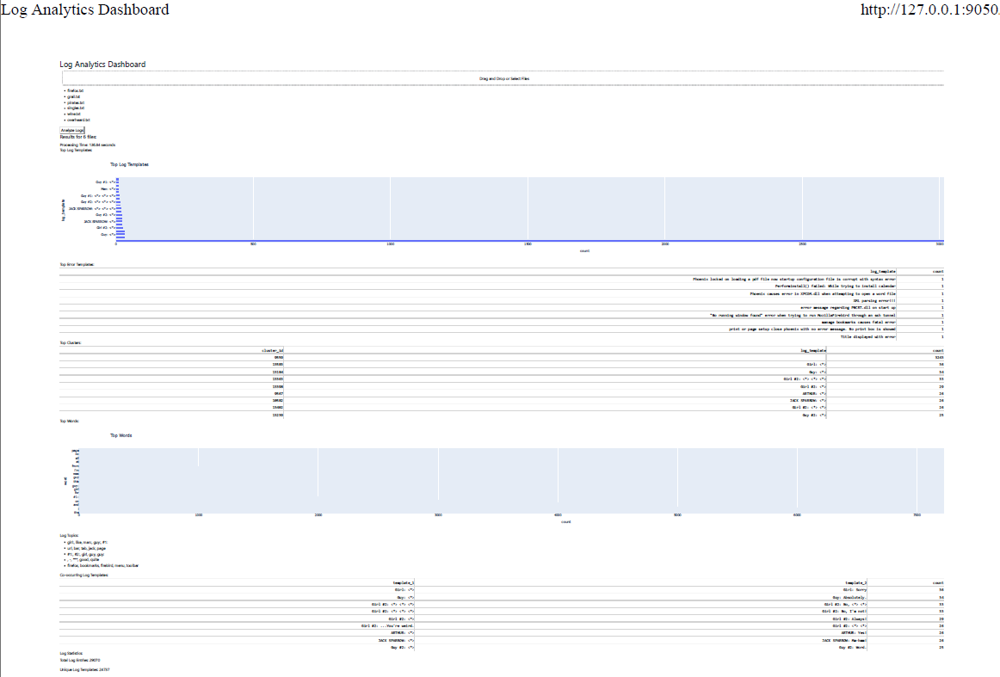

# Log Analytics Framework


## Overview

This Log Analytics Framework provides an efficient way to parse, analyze, and visualize log data. 
Using Drain3 for log parsing and PySpark for analytics, users can upload multiple log files through a web dashboard 
and gain insights into their log data.

## Features

- **Log Parsing with Drain3:** Efficiently parse logs into structured data.
- **Scalable Analytics with PySpark:** Perform large-scale data analysis.
- **Web Dashboard:** Upload log files and visualize results.

## Installation

1. **Clone the Repository:**
    ```bash
    git clone https://github.com/nnn007/log-analytics.git
    cd log-analytics-web-app
    ```

2. **Install Dependencies:**
    ```bash
    pip install -r requirements.txt
    ```

## Usage

1. **Run the Web Dashboard:**
    ```bash
    python app.py
    ```

2. **Upload Log Files:**
    - Access the web dashboard via this URL : http://127.0.0.1:9050/.
    - Upload one or more log files for analysis.

3. **View Analytics:**
    - After processing, view the parsed logs and analytics results on the dashboard.

## Contributing
This is just a preliminary analytics framework at this stage.
I welcome contributions from the community! Please follow these steps:

1. **Fork the Repository**
2. **Create a New Branch**
    ```bash
    git checkout -b feature-branch
    ```
3. **Commit Your Changes**
    ```bash
    git commit -m "Add new feature"
    ```
4. **Push to the Branch**
    ```bash
    git push origin feature-branch
    ```
5. **Create a Pull Request**

## License

This project is licensed under the MIT License. See the [LICENSE](LICENSE) file for details.

## Contact

For any questions or suggestions, please open an issue or reach out to us at [nayan.nilesh@gmail.com](mailto:nayan.nilesh@gmail.com).
